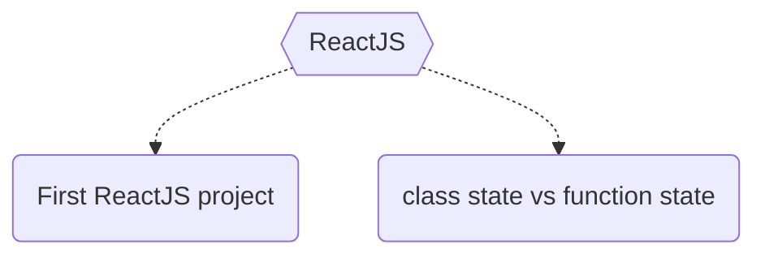

# ReactJS-resources
ReactJS resources and source codes by Neck

### Find more about author
- :hand: [buy me a coffee](https://www.buymeacoffee.com/neck)
- :bell: [Subscrib to the channel](https://www.youtube.com/channel/UC-5HS-AeihwNU6s8tCVWuVw?sub_confirmation=1): Code with Neck
- :+1: [Twitter](https://twitter.com/Nechir89)
- :v: [Linkedin](https://www.linkedin.com/in/neck2019/)

### Resources
- Creating your first ReactJS project [YouTube video](https://www.youtube.com/watch?v=q7zhs3Jv30E&ab_channel=CodewithNeck)
- State in class component and state in function component [source code](https://github.com/Nechir-89/state-in-class-vs-in-function)

### map

